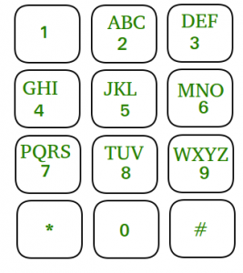

## Асуудал


Танд 2-9 ийн хоорондох тоонуудаас бүрдэх дээд талдаа 8 урттай array өгнө . Та эдгээр дугаараас дарааллаад дарахад нийт хэдэн ялгаатай үсгээр бичиж болох `array` буцаах байгаа .
Жишээ нь: [2,3] байг. 2-'abc' , 3- 'def' хэмээх үсэгнүүд байна . Тэгвэл хариу нь: ` ad ae af bd be bf cd ce cf` байна .

## Шийдэл

```
export class SoftP0410 {
  private numbers = Array.from({ length: 8 }, (_, i: number) => i + 2);
  private lastLetterUnicode = 65;
  private numToLetters: Map<number, string[]> = new Map(
    this.numbers.map((number) => {
      let lettersLength = 3;
      if (number == 7 || number == 9) {
        lettersLength = 4;
      }
      const letters: string[] = Array.from(
        { length: lettersLength },
        (_, i: number) => i + this.lastLetterUnicode
      ).map((unicode) => String.fromCharCode(unicode));
      this.lastLetterUnicode += lettersLength;
      return [number, letters];
    })
  );
  public solution(arr: number[], subStr: string): string[] {
    if (arr.length == subStr.length) return [subStr];
    let result: string[] = [];
    const numLetters = this.numToLetters.get(arr[subStr.length]);
    for (let i = 0; i < (numLetters?.length || 0); i++) {
      const subarr = this.solution(
        arr,
        subStr + (numLetters && numLetters[i]) || ""
      );
      result = [...result, ...subarr];
    }
    return result;
  }
}
```

Үүнд юуны түрүүнд numToLetters нь `hashmap` үүсгэж байна .Жишээ нь

```
{
    2->['a','b','c'],
    3->['d','e','f'],
} гэх мэт

```

subStr хэмээх хувьсагч нь боломжит хувилбарыг хадгалж байгаа . Хэрвээ subStr ийн урт нь цифрүүдийн урттай тэнцвэл энэхүү хувилбарыг `array ` дотор буцааж байгаа . Давталт дотор тухайн цифр дээр дарагдах боломжит үсэгнүүдээс нэг нэгээр боломжит хувилбарыг үүсгэн үүн дээр дараагийн цифрийн үсгүүдийг нэмэхийн тулд рекурсив байдлаар дуудаж байгаа . Эцэст нь spread operator ашиглан үр дүнгүүдийг нэгтгэж байгаад буцааж байна .
