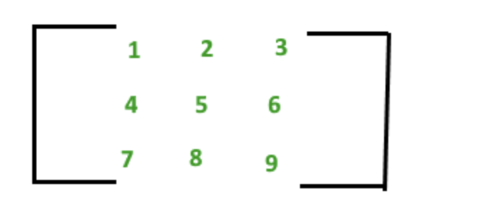
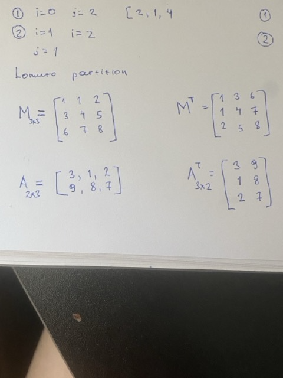
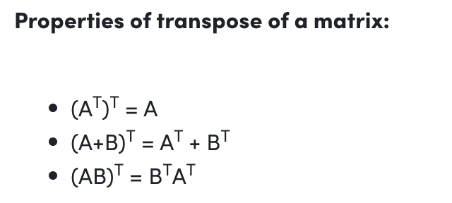
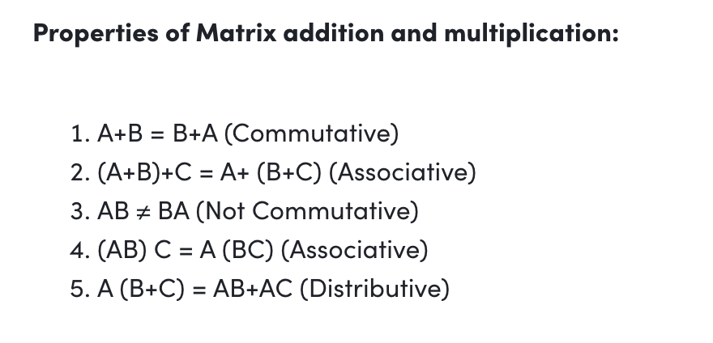
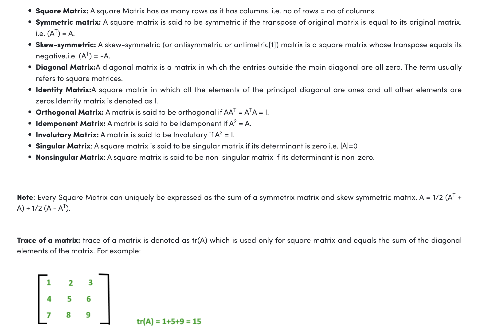

# Матриц

## Ерөнхий дүгнэлт

Матрикс , түүний нэмэн хасах үйлдэл , хөрвүүлэлт , нэр томьёо , тэмдэглэлийн талаар харна.

## Агуулга

1. [Матрикс гэж юу вэ ?](#матрикс-гэж-юу-вэ-)
2. [Матрицын хөрвүүлэлт](#mатрицын-хөрвүүлэлт)
3. [Матрицын хөрвүүлэлт нь дараах чанартай](#mатрицын-хөрвүүлэлт-нь-дараах-чанартай)
4. [Матрицын нэмэх болон үржих үйлдлийн чанрууд](#матрицын-нэмэх-болон-үржих-үйлдлийн-чанрууд)
5. [Матрицын нэр томьёо , тэмдэглэл](#матрицын-нэр-томьёо--тэмдэглэл)

### Матрикс гэж юу вэ ?

### Mатрицын хөрвүүлэлт

### Mатрицын хөрвүүлэлт нь дараах чанартай .

### Матрицын нэмэх болон үржих үйлдлийн чанрууд

### Матрицын нэр томьёо , тэмдэглэл

